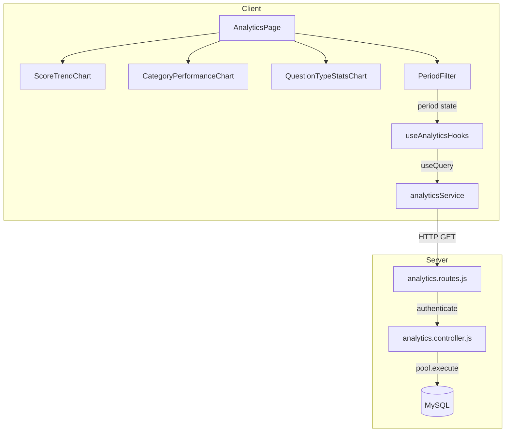

# Design Document: Analytics Feature

## Overview

Tính năng Analytics bổ sung một trang phân tích học tập tại route `/analytics`, cung cấp ba góc nhìn dữ liệu: biểu đồ điểm số theo thời gian, hiệu suất theo danh mục, và tỷ lệ đúng/sai theo loại câu hỏi. Toàn bộ dữ liệu được tổng hợp từ các bảng hiện có qua SQL aggregation — không cần thêm bảng mới.

Kiến trúc tuân theo đúng pattern đã có trong dự án:
- **Backend**: Express controller + route file, sử dụng `pool.execute`, `successResponse`, và `authenticate` middleware.
- **Frontend**: Feature folder `src/features/analytics/` với service, hooks (TanStack Query), và components; page `AnalyticsPage` lắp ráp tất cả lại.

---

## Architecture



**Data flow:**
1. `AnalyticsPage` mount → TanStack Query gọi 3 hooks song song.
2. Mỗi hook gọi service tương ứng → axios GET đến `/api/analytics/*`.
3. Server xác thực JWT, chạy SQL aggregation, trả về JSON.
4. TanStack Query cache kết quả; component render chart từ data.
5. Khi user thay đổi `period`, `useScoreTrend(period)` refetch với queryKey mới.

---

## Components and Interfaces

### Backend

#### `analytics.controller.js`

```
getScoreTrend(req, res, next)
  - Query param: period (30d | 90d | 6m | 1y), default 30d
  - Validates period; returns 400 for invalid values
  - Returns: ScoreTrendPoint[]

getCategoryPerformance(req, res, next)
  - No query params
  - Returns: CategoryPerformanceItem[]

getQuestionTypeStats(req, res, next)
  - No query params
  - Returns: QuestionTypeStatItem[]
```

#### `analytics.routes.js`

```
router.use(authenticate)
GET /score-trend        → getScoreTrend
GET /category-performance → getCategoryPerformance
GET /question-type-stats  → getQuestionTypeStats
```

Đăng ký trong `server/src/index.js`:
```js
app.use("/api/analytics", analyticsRoutes);
```

### Frontend — `src/features/analytics/`

```
services/
  analyticsService.ts     — 3 API call functions
hooks/
  useAnalytics.ts         — 3 TanStack Query hooks
components/
  ScoreTrendChart.tsx
  CategoryPerformanceChart.tsx
  QuestionTypeStatsChart.tsx
index.ts                  — re-exports
```

#### Service interface

```typescript
analyticsService.getScoreTrend(period: Period): Promise<ScoreTrendPoint[]>
analyticsService.getCategoryPerformance(): Promise<CategoryPerformanceItem[]>
analyticsService.getQuestionTypeStats(): Promise<QuestionTypeStatItem[]>
```

#### Hooks interface

```typescript
useScoreTrend(period: Period)          // queryKey: ['analytics', 'score-trend', period]
useCategoryPerformance()               // queryKey: ['analytics', 'category-performance']
useQuestionTypeStats()                 // queryKey: ['analytics', 'question-type-stats']
```

---

## Data Models

### API Response Types

```typescript
// Period filter values
export type Period = '30d' | '90d' | '6m' | '1y'

// GET /api/analytics/score-trend
export interface ScoreTrendPoint {
  attemptId: number
  testTitle: string
  score: number
  passingScore: number
  completedAt: string  // ISO 8601
}

// GET /api/analytics/category-performance
export interface CategoryPerformanceItem {
  categoryId: number
  categoryName: string
  categoryIcon: string | null
  averageScore: number   // 0–100, rounded
  passRate: number       // 0–100, rounded (percentage)
  attemptCount: number
}

// GET /api/analytics/question-type-stats
export interface QuestionTypeStatItem {
  questionType: 'single' | 'multiple'
  correctCount: number
  incorrectCount: number
  totalCount: number     // correctCount + incorrectCount
}
```

### SQL Queries

#### Score Trend

```sql
-- period mapped to: 30d→INTERVAL 30 DAY, 90d→90 DAY, 6m→6 MONTH, 1y→1 YEAR
SELECT
  ta.id          AS attemptId,
  t.title        AS testTitle,
  ta.score,
  t.passing_score AS passingScore,
  ta.completed_at AS completedAt
FROM test_attempts ta
JOIN tests t ON t.id = ta.test_id
WHERE ta.user_id = ?
  AND ta.completed_at IS NOT NULL
  AND ta.completed_at >= DATE_SUB(NOW(), INTERVAL ? DAY)  -- parameterised
ORDER BY ta.completed_at ASC
```

Period → interval mapping (validated server-side):
| period | SQL interval |
|--------|-------------|
| 30d    | 30 DAY      |
| 90d    | 90 DAY      |
| 6m     | 6 MONTH     |
| 1y     | 1 YEAR      |

Because `DATE_SUB` does not accept a single `?` placeholder for both value and unit, the controller builds the interval string from a whitelist map and interpolates it directly (no user input reaches the string).

#### Category Performance

```sql
SELECT
  c.id                                          AS categoryId,
  c.name                                        AS categoryName,
  c.icon                                        AS categoryIcon,
  ROUND(AVG(ta.score), 0)                       AS averageScore,
  ROUND(
    SUM(CASE WHEN ta.score >= t.passing_score THEN 1 ELSE 0 END)
    * 100.0 / COUNT(*), 0
  )                                             AS passRate,
  COUNT(*)                                      AS attemptCount
FROM test_attempts ta
JOIN tests t     ON t.id = ta.test_id
JOIN categories c ON c.id = t.category_id
WHERE ta.user_id = ?
  AND ta.completed_at IS NOT NULL
GROUP BY c.id, c.name, c.icon
ORDER BY attemptCount DESC
```

#### Question Type Stats

```sql
SELECT
  q.type                                        AS questionType,
  SUM(CASE WHEN taa.is_correct = 1 THEN 1 ELSE 0 END) AS correctCount,
  SUM(CASE WHEN taa.is_correct = 0 THEN 1 ELSE 0 END) AS incorrectCount,
  COUNT(*)                                      AS totalCount
FROM test_attempt_answers taa
JOIN test_attempts ta ON ta.id = taa.attempt_id
JOIN questions q      ON q.id = taa.question_id
WHERE ta.user_id = ?
  AND ta.completed_at IS NOT NULL
GROUP BY q.type
```

---

## Correctness Properties

*A property is a characteristic or behavior that should hold true across all valid executions of a system — essentially, a formal statement about what the system should do. Properties serve as the bridge between human-readable specifications and machine-verifiable correctness guarantees.*

### Property 1: Score trend period filter correctness

*For any* user with a set of completed attempts and any valid period value, every data point returned by `GET /api/analytics/score-trend?period=<P>` SHALL have a `completedAt` timestamp that falls within the last `<P>` interval from the time of the request.

**Validates: Requirements 1.2**

---

### Property 2: Score trend response shape completeness

*For any* user with at least one completed attempt, every object in the array returned by `GET /api/analytics/score-trend` SHALL contain the fields `attemptId`, `testTitle`, `score`, `passingScore`, and `completedAt`, each with a non-null value of the correct type.

**Validates: Requirements 1.4**

---

### Property 3: Invalid period rejected with 400

*For any* string that is not one of `30d`, `90d`, `6m`, `1y`, a request to `GET /api/analytics/score-trend?period=<invalid>` SHALL return HTTP 400.

**Validates: Requirements 1.6**

---

### Property 4: Category performance response shape and uniqueness

*For any* user with completed attempts across one or more categories, the array returned by `GET /api/analytics/category-performance` SHALL contain exactly one entry per category (no duplicate `categoryId`), and each entry SHALL contain `categoryId`, `categoryName`, `categoryIcon`, `averageScore`, `passRate`, and `attemptCount` with correct types.

**Validates: Requirements 2.3, 2.4**

---

### Property 5: Category performance sorted by attemptCount descending

*For any* user with attempts in multiple categories, the array returned by `GET /api/analytics/category-performance` SHALL be ordered such that for every adjacent pair of entries `[i]` and `[i+1]`, `entries[i].attemptCount >= entries[i+1].attemptCount`.

**Validates: Requirements 2.4**

---

### Property 6: Question type stats totalCount invariant

*For any* user with answer history, every object in the array returned by `GET /api/analytics/question-type-stats` SHALL satisfy `totalCount === correctCount + incorrectCount`.

**Validates: Requirements 3.3**

---

### Property 7: Question type stats only returns types with data

*For any* user whose answer history contains only one question type, the array returned by `GET /api/analytics/question-type-stats` SHALL contain exactly one entry matching that type.

**Validates: Requirements 3.4**

---

### Property 8: Unauthenticated requests are rejected

*For any* analytics endpoint (`/score-trend`, `/category-performance`, `/question-type-stats`), a request made without a valid Bearer token SHALL receive HTTP 401.

**Validates: Requirements 4.1, 4.3**

---

### Property 9: User data isolation

*For any* two distinct authenticated users A and B, the analytics data returned for user A SHALL contain no records whose underlying `user_id` belongs to user B.

**Validates: Requirements 4.2**

---

## Error Handling

| Scenario | Backend behaviour | Frontend behaviour |
|---|---|---|
| Invalid `period` param | Return 400 with `{ success: false, message: "Invalid period. Allowed: 30d, 90d, 6m, 1y" }` | Show error toast; keep previous chart data |
| No JWT / expired JWT | Return 401 (handled by `authenticate` middleware) | Axios interceptor redirects to `/login` |
| DB query failure | `next(error)` → global `errorHandler` returns 500 | Show error card with "Retry" button per chart section |
| Empty result set | Return 200 with `data: []` | Chart component renders empty-state UI |
| Network timeout | — | TanStack Query retries up to 2 times; then shows error state |

---

## Testing Strategy

### Backend — Unit / Integration Tests

Use a test database or mock `pool.execute` to verify:

- `getScoreTrend` returns only attempts within the requested period (example-based: insert 5 attempts, 3 within period, verify count = 3).
- `getScoreTrend` returns 400 for invalid period strings.
- `getCategoryPerformance` returns correct `averageScore` and `passRate` calculations for known data.
- `getQuestionTypeStats` returns correct `correctCount` / `incorrectCount` split for known data.
- All three endpoints return 401 when called without a token.

### Frontend — Component Tests (Vitest + React Testing Library)

- `ScoreTrendChart` renders a `<LineChart>` when given non-empty data.
- `ScoreTrendChart` renders empty-state when given `[]`.
- `CategoryPerformanceChart` renders a `<BarChart>` when given non-empty data.
- `QuestionTypeStatsChart` renders a `<PieChart>` when given non-empty data.
- `AnalyticsPage` shows skeleton loaders while queries are loading.
- `AnalyticsPage` shows error state when a query fails.
- Period filter buttons update the active period and trigger a refetch.

### Property-Based Tests (Vitest + fast-check)

Each property test runs a minimum of **100 iterations**. Tag format: `Feature: analytics, Property N: <property_text>`.

- **Property 1** — Generate random arrays of `ScoreTrendPoint` with varying `completedAt` values; assert all returned points fall within the selected period window.
- **Property 2** — Generate random attempt data; assert every returned score-trend object has all required fields with correct types.
- **Property 3** — Generate arbitrary strings excluding valid period values; assert the period validator always returns false / 400.
- **Property 4** — Generate random attempt data across multiple categories; assert no duplicate `categoryId` and all required fields present.
- **Property 5** — Generate random category performance arrays; assert the sort comparator produces a non-increasing `attemptCount` sequence.
- **Property 6** — Generate random `correctCount` and `incorrectCount` values; assert `totalCount === correctCount + incorrectCount` after aggregation.
- **Property 7** — Generate answer history with only `single` type questions; assert result array length === 1 and `questionType === 'single'`.
- **Property 8** — Assert all three endpoints return 401 without a token (example-based, 3 assertions).
- **Property 9** — Generate two users with disjoint attempt sets; assert user A's analytics contain no `user_id` from user B.

> Properties 4 and 5 overlap on the uniqueness/shape concern — they are kept separate because Property 4 validates shape completeness while Property 5 validates ordering. Both provide unique validation value.
