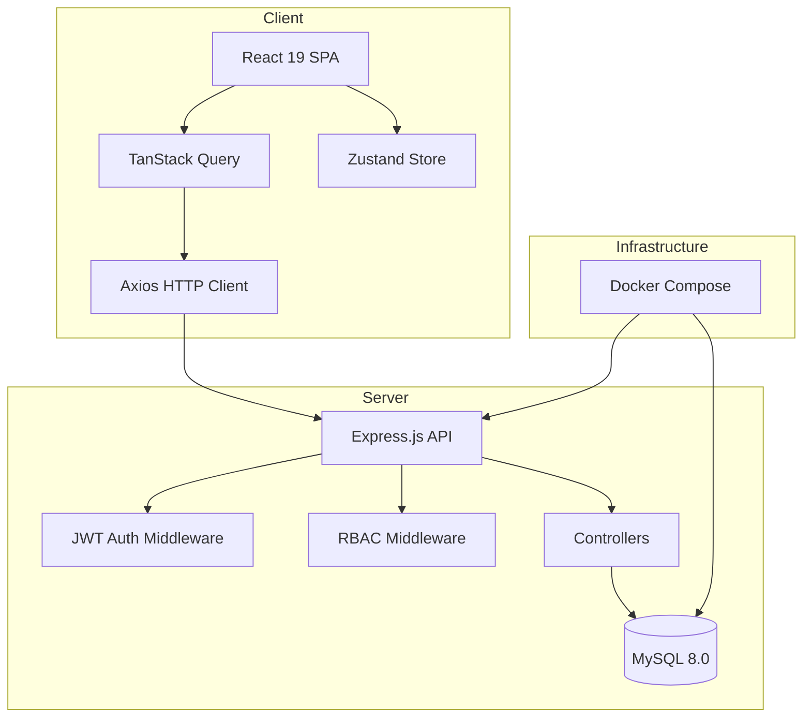

# Review Certs

A full-stack certification quiz platform for creating, managing, and taking MCQ exams. Built for teams and individuals who want to track learning progress, set goals, and collaborate through study groups.

---

## Introduction

Review Certs is designed for organizations, study groups, and individuals who need a structured way to practice and certify knowledge through multiple-choice exams. It supports role-based access (Admin, Manager, User), study groups with shared goals, a blog system for knowledge sharing, and analytics dashboards to track progress over time.

---

## Key Features

- **Exam Management** — Create categories, tests with multiple question types (single/multiple choice), set passing scores and difficulty levels
- **Test Taking** — Timed exam interface, instant scoring, detailed result breakdowns with explanations
- **Study Groups** — Create groups, assign mandatory exams, track collective progress, leaderboards, and group discussions
- **Learning Goals** — Set personal certification goals with deadlines and track completion
- **Analytics Dashboard** — Score trends, category performance, streak tracking, activity heatmaps
- **Blog System** — Publish articles with SEO metadata, scheduling, likes, and view tracking
- **Bookmarks** — Save tests for later review
- **Role-Based Access Control** — Admin (full access), Manager (content management), User (test-taking)

---

## Architecture Overview



| Layer            | Technology                                                    |
| ---------------- | ------------------------------------------------------------- |
| Frontend         | React 19, Vite, TypeScript, Tailwind CSS, shadcn/ui, Radix UI |
| State Management | Zustand (auth), TanStack Query (server state)                 |
| Backend          | Node.js 20, Express.js                                        |
| Database         | MySQL 8.0 with UUID primary keys                              |
| Authentication   | JWT Bearer tokens, bcrypt password hashing                    |
| Containerization | Docker, Docker Compose                                        |

For detailed architecture diagrams and decisions, see [ARCHITECTURE.md](./docs/ARCHITECTURE.md).

---

## Installation

### Prerequisites

- Node.js v18+ (v20 recommended)
- MySQL 8.0+ (or Docker)
- npm or yarn

### Quick Start (with Docker)

```bash
# Clone the repository
git clone <repository-url>
cd review-certs

# Start database and API server
docker-compose up -d

# Install frontend dependencies and start dev server
cd client
npm install
npm run dev
```

The API will be available at `http://localhost:3000` and the frontend at `http://localhost:5173`.

### Manual Setup

See [ENVIRONMENT_SETUP.md](./docs/ENVIRONMENT_SETUP.md) for detailed step-by-step instructions.

---

## Running the Project

### Development

```bash
# Terminal 1: Start the backend
cd server
npm install
npm run dev          # Starts with nodemon (auto-reload)

# Terminal 2: Start the frontend
cd client
npm install
npm run dev          # Starts Vite dev server
```

### Production (Docker)

```bash
docker-compose up -d --build
```

See [DEPLOYMENT_GUIDE.md](./docs/DEPLOYMENT_GUIDE.md) for production deployment.

---

## Environment Configuration

### Server (`server/.env`)

| Variable         | Required | Default       | Description               |
| ---------------- | -------- | ------------- | ------------------------- |
| `PORT`           | No       | `3000`        | API server port           |
| `NODE_ENV`       | No       | `development` | Environment mode          |
| `DB_HOST`        | Yes      | —             | MySQL host                |
| `DB_PORT`        | No       | `3306`        | MySQL port                |
| `DB_USER`        | Yes      | —             | MySQL user                |
| `DB_PASSWORD`    | Yes      | —             | MySQL password            |
| `DB_NAME`        | Yes      | —             | Database name             |
| `JWT_SECRET`     | Yes      | —             | Secret for signing tokens |
| `JWT_EXPIRES_IN` | No       | `7d`          | Token expiration duration |

### Client (`client/.env`)

| Variable            | Required | Default                     | Description     |
| ------------------- | -------- | --------------------------- | --------------- |
| `VITE_API_BASE_URL` | No       | `http://localhost:3000/api` | Backend API URL |
| `VITE_APP_BASE_URL` | No       | `http://localhost:5173`     | Frontend URL    |

---

## Demo Credentials

| Role    | Email               | Password |
| ------- | ------------------- | -------- |
| Admin   | admin@example.com   | password |
| Manager | manager@example.com | password |
| User    | user@example.com    | password |

---

## Folder Structure

```
review-certs/
├── client/                  # React + Vite frontend
│   ├── src/
│   │   ├── app/             # App shell, routing
│   │   ├── components/      # Shared components (ui, layout, common)
│   │   ├── features/        # Feature modules (auth, tests, blogs, groups...)
│   │   ├── lib/             # Infrastructure (axios, query client, utils)
│   │   ├── pages/           # Route-level page components
│   │   ├── types/           # TypeScript type definitions
│   │   └── constants/       # Route paths, regex patterns
│   └── ...config files
│
├── server/                  # Node.js + Express backend
│   ├── src/
│   │   ├── controllers/     # HTTP request handlers
│   │   ├── middleware/      # Auth, RBAC, error handling
│   │   ├── routes/          # Route definitions
│   │   ├── config/          # Database configuration
│   │   └── utils/           # Response helpers
│   └── database/            # Schema, migrations, seeds
│
├── docs/                    # Project documentation
├── docker-compose.yml       # Container orchestration
└── README.md
```

For complete details, see [FOLDER_STRUCTURE.md](./docs/FOLDER_STRUCTURE.md).

---

## Role Permissions

| Permission       | Admin | Manager |   User    |
| ---------------- | :---: | :-----: | :-------: |
| Manage Users     |  Yes  |    —    |     —     |
| CRUD Categories  |  Yes  |   Yes   |     —     |
| CRUD Tests/Exams |  Yes  |   Yes   |     —     |
| Manage Blogs     |  Yes  |   Yes   | Own only  |
| Take Tests       |  Yes  |   Yes   |    Yes    |
| View Own Results |  Yes  |   Yes   |    Yes    |
| View All Results |  Yes  |   Yes   |     —     |
| Manage Groups    |  Yes  |   Yes   | Yes (own) |

---

## Contributing

We welcome contributions. Please read [CONTRIBUTING.md](./docs/CONTRIBUTING.md) for guidelines on:

- Code style and conventions
- Branch naming and commit messages
- Pull request process
- Development workflow

---

## Documentation

| Document                                           | Description                                       |
| -------------------------------------------------- | ------------------------------------------------- |
| [Architecture](./docs/ARCHITECTURE.md)             | System design, data flow, and technical decisions |
| [Codebase Overview](./docs/CODEBASE_OVERVIEW.md)   | High-level code walkthrough                       |
| [Folder Structure](./docs/FOLDER_STRUCTURE.md)     | Directory layout explained                        |
| [Coding Conventions](./docs/CODING_CONVENTIONS.md) | Style guide and patterns                          |
| [Contributing](./docs/CONTRIBUTING.md)             | How to contribute                                 |
| [Environment Setup](./docs/ENVIRONMENT_SETUP.md)   | Dev environment configuration                     |
| [Deployment Guide](./docs/DEPLOYMENT_GUIDE.md)     | Production deployment                             |
| [API Reference](./docs/API_REFERENCE.md)           | REST API endpoints                                |

---

## License

This project is private. All rights reserved.

---

## Roadmap

- [ ] Add user registration flow
- [ ] Add email verification
- [ ] Implement password reset
- [ ] Add real-time notifications (WebSocket)
- [ ] Add image upload (avatars, blog covers)
- [ ] Implement test timer tracking server-side
- [ ] Add export (PDF certificates, Excel reports)
- [ ] i18n / multi-language support
- [ ] Add comprehensive test suite
- [ ] CI/CD pipeline with GitHub Actions
