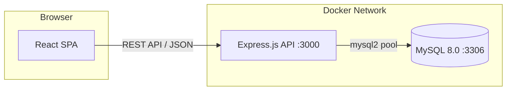
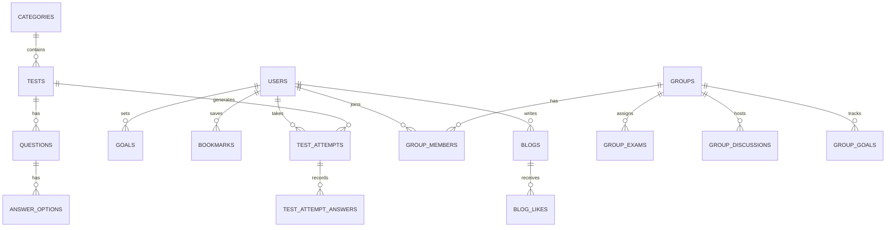
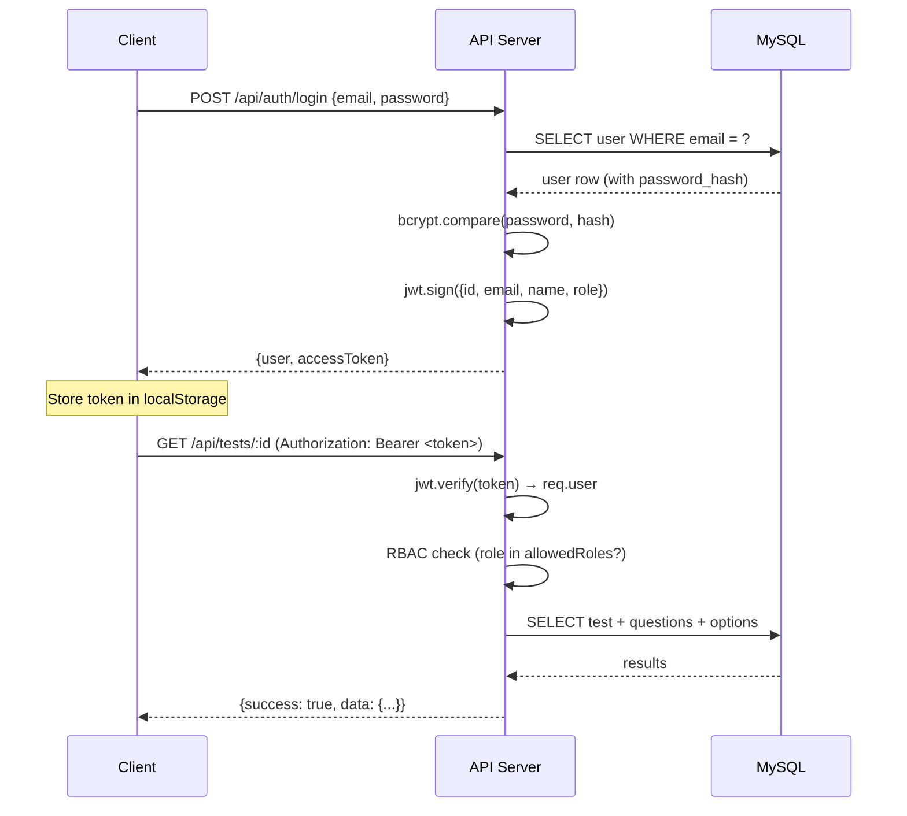
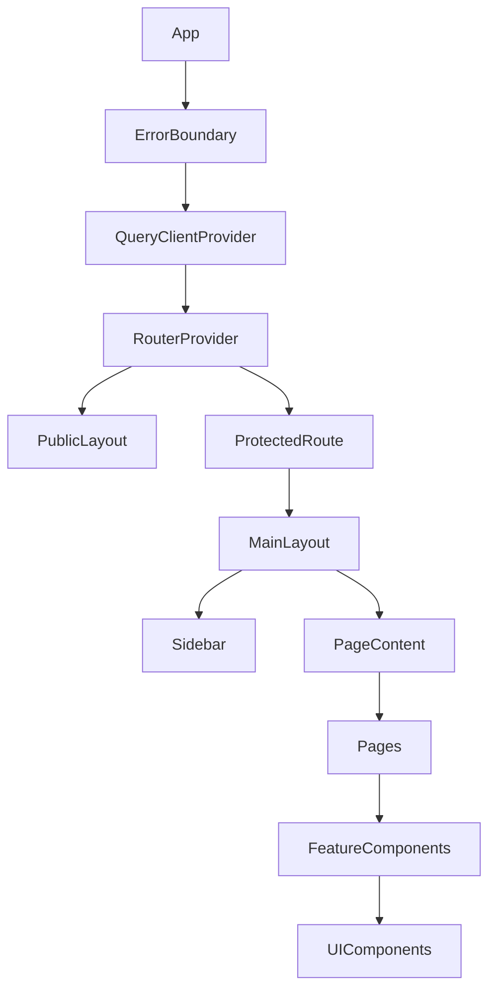
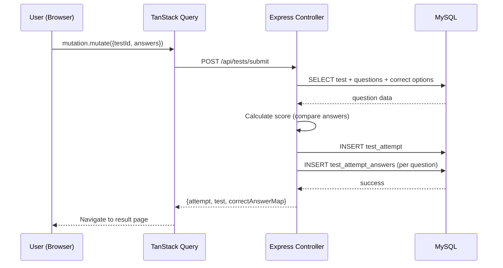
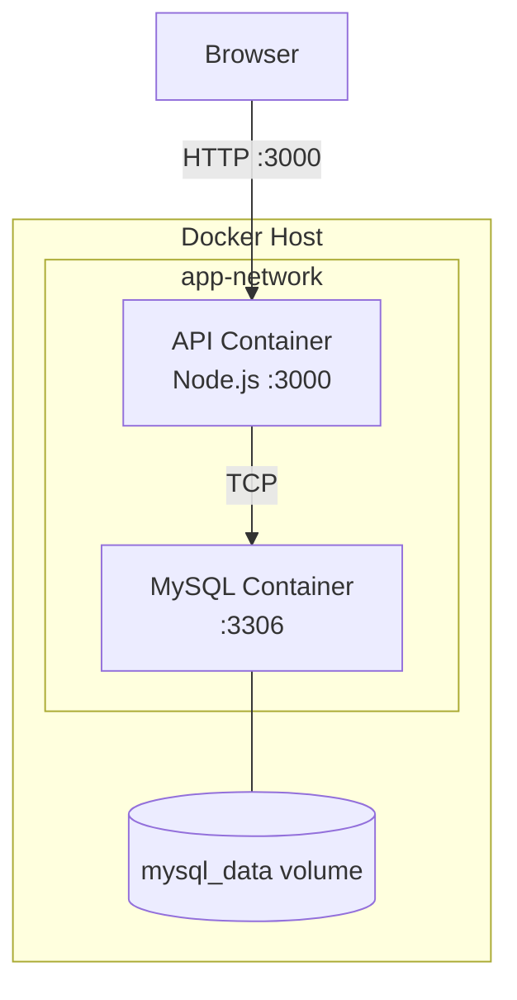
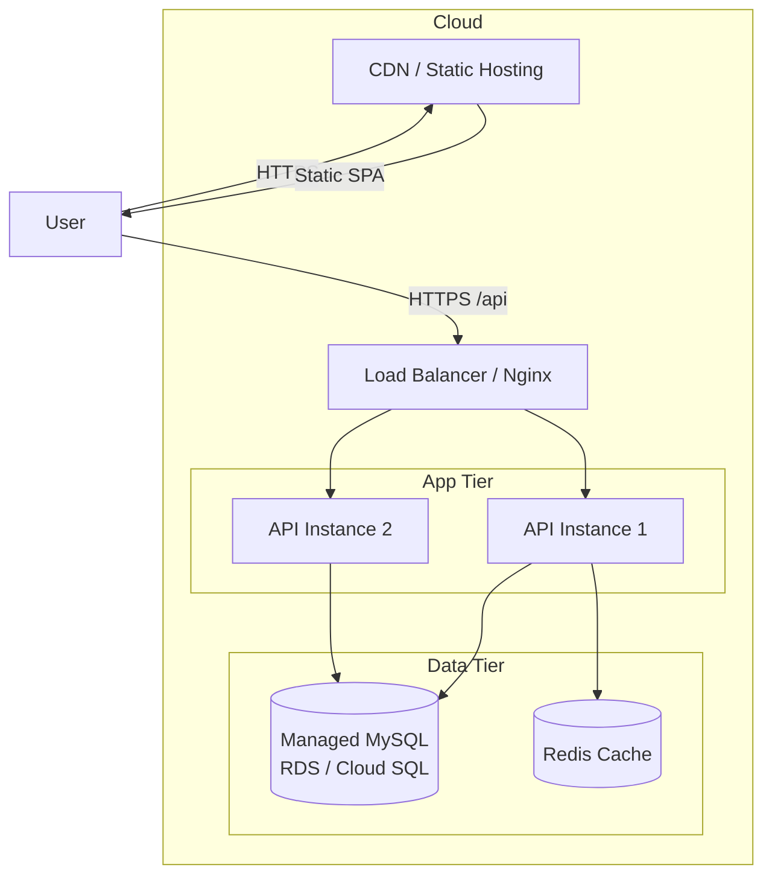

# Architecture

This document describes the system architecture, technical decisions, data flow, and component relationships in the Review Certs platform.

---

## System Overview

Review Certs is a monorepo containing two independent applications that communicate over HTTP:



---

## Technology Decisions

### Why React 19 + Vite?

- React 19 brings performance improvements and concurrent features
- Vite provides near-instant HMR and fast builds (esbuild + Rollup)
- TypeScript for type safety across the frontend
- TanStack Query for server-state management with caching, deduplication, and background refetching

### Why Express.js (not Fastify, NestJS)?

- Lightweight, minimal opinion — fits a CRUD-heavy API well
- Massive ecosystem of middleware
- Team familiarity
- Low overhead for a project of this scale

### Why MySQL (not PostgreSQL, MongoDB)?

- Relational data model fits the domain (categories → tests → questions → options)
- Strong referential integrity (CASCADE deletes)
- Good JSON column support for flexible fields (selected_option_ids)
- MySQL 8.0 supports CTEs, window functions, and JSON operations

### Why raw SQL (not Prisma, TypeORM, Knex)?

- Full control over query optimization
- No ORM abstraction leakage
- Simpler deployment (no schema generation step)
- Trade-off: more boilerplate, harder to maintain

---

## Data Architecture

### Entity Relationship Diagram



### Key Design Decisions

| Decision | Rationale |
|----------|-----------|
| UUID primary keys | Avoid sequential ID enumeration, safe for distributed systems |
| Soft deletes (`deleted_at`) | Preserve data integrity, enable recovery, maintain referential consistency |
| JSON column for `selected_option_ids` | Flexible storage for variable-length answer arrays |
| Separate `test_attempt_answers` table | Enables per-question analytics and detailed result review |

---

## Authentication & Authorization Flow



### Token Strategy

- **Type:** JWT (stateless)
- **Storage:** localStorage (client)
- **Expiry:** 7 days (configurable via `JWT_EXPIRES_IN`)
- **Payload:** `{ id, email, name, role }`
- **Refresh:** Not implemented (token re-issued on login)

---

## API Design Principles

### Response Format

All API responses follow a consistent envelope:

```json
// Success
{ "success": true, "message": "...", "data": { ... } }

// Paginated
{ "data": [...], "total": 42, "page": 1, "pageSize": 10, "totalPages": 5 }

// Error
{ "success": false, "message": "...", "statusCode": 400 }
```

### URL Conventions

| Pattern | Example | Description |
|---------|---------|-------------|
| `GET /api/{resource}` | `/api/categories` | List resources |
| `GET /api/{resource}/:id` | `/api/tests/:id` | Get single resource |
| `POST /api/{resource}` | `/api/tests` | Create resource |
| `PUT /api/{resource}/:id` | `/api/tests/:id` | Update resource |
| `DELETE /api/{resource}/:id` | `/api/tests/:id` | Soft-delete resource |
| `POST /api/{resource}/:id/{action}` | `/api/groups/:id/reset` | Custom action |

---

## Frontend Architecture

### Component Hierarchy



### State Management Strategy

| State Type | Tool | Example |
|-----------|------|---------|
| Server state (API data) | TanStack Query | Tests, categories, history |
| Auth state (persistent) | Zustand + localStorage | User session, token |
| UI state (permission config) | Zustand | Role permissions matrix |
| Form state | react-hook-form + Zod | Login form, test creation |
| Local component state | useState/useReducer | Modal open, active tab |

### Feature Module Structure

Each feature in `src/features/` follows this internal pattern:

```
features/{feature}/
├── components/      # Feature-specific UI components
├── hooks/           # Custom hooks (useQuery wrappers)
├── services/        # API call functions
├── store/           # Zustand store (if needed)
├── utils/           # Feature-specific helpers
└── index.ts         # Public API (barrel export)
```

---

## Data Flow: Test Submission



---

## Deployment Architecture

### Docker Compose (Current)



### Production Recommendations



---

## Security Architecture

| Layer | Mechanism |
|-------|-----------|
| Transport | HTTPS (enforced in production) |
| Authentication | JWT Bearer tokens |
| Authorization | Role-based (Admin, Manager, User) |
| Password Storage | bcrypt (salt rounds = 10) |
| SQL Injection | Parameterized queries (mysql2 placeholders) |
| Data Deletion | Soft delete (reversible) |
| Secrets | Environment variables (no hardcoded secrets in code) |

---

## Known Limitations

1. **No refresh token** — users must re-login after 7 days
2. **No file upload** — avatars and images are URL-only
3. **No real-time features** — no WebSocket/SSE
4. **Single database** — no read replicas or sharding
5. **No caching layer** — every request hits MySQL
6. **No background jobs** — all processing is synchronous in the request cycle
