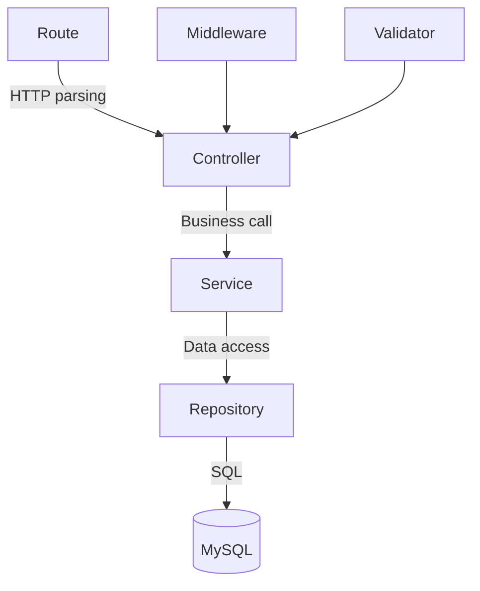

# Refactor Plan — Review Certs

**Date:** June 21, 2026  
**Author Role:** Principal Software Architect  
**Scope:** Backend restructuring, frontend polish, DevOps standardization  

---

## Table of Contents

1. [Proposed Folder Structure](#1-proposed-folder-structure)
2. [Naming Standardization](#2-naming-standardization)
3. [Backend Layered Architecture](#3-backend-layered-architecture)
4. [Input Validation Strategy](#4-input-validation-strategy)
5. [Eliminate Hardcoded Values](#5-eliminate-hardcoded-values)
6. [Config Standardization](#6-config-standardization)
7. [API & Service Boundaries](#7-api--service-boundaries)
8. [Design Patterns to Apply](#8-design-patterns-to-apply)
9. [Database & Migration Strategy](#9-database--migration-strategy)
10. [Security Hardening](#10-security-hardening)
11. [Testing Strategy](#11-testing-strategy)
12. [Migration Guide (Step-by-Step)](#12-migration-guide)

---

## 1. Proposed Folder Structure

### Backend (server/)

```
server/
├── src/
│   ├── config/
│   │   ├── database.js          # Pool setup
│   │   ├── cors.js              # CORS configuration
│   │   ├── env.js               # Env validation & export
│   │   └── index.js             # Barrel export
│   │
│   ├── constants/
│   │   ├── defaults.js          # Default values (duration, scores, etc.)
│   │   ├── pagination.js        # Pagination constants
│   │   ├── roles.js             # Role & permission definitions
│   │   └── index.js
│   │
│   ├── controllers/             # Thin HTTP layer (parse request → call service → send response)
│   │   ├── auth.controller.js
│   │   ├── blog.controller.js
│   │   ├── category.controller.js
│   │   ├── dashboard.controller.js
│   │   ├── goal.controller.js
│   │   ├── group.controller.js
│   │   ├── history.controller.js
│   │   ├── analytics.controller.js
│   │   └── test.controller.js
│   │
│   ├── services/                # Business logic layer
│   │   ├── auth.service.js
│   │   ├── blog.service.js
│   │   ├── category.service.js
│   │   ├── dashboard.service.js
│   │   ├── goal.service.js
│   │   ├── group.service.js
│   │   ├── history.service.js
│   │   ├── analytics.service.js
│   │   ├── notification.service.js
│   │   └── test.service.js
│   │
│   ├── repositories/            # Data access layer (SQL queries only)
│   │   ├── user.repository.js
│   │   ├── test.repository.js
│   │   ├── category.repository.js
│   │   ├── attempt.repository.js
│   │   ├── group.repository.js
│   │   ├── blog.repository.js
│   │   ├── goal.repository.js
│   │   ├── bookmark.repository.js
│   │   └── notification.repository.js
│   │
│   ├── middleware/
│   │   ├── auth.js              # JWT verification only
│   │   ├── rbac.js              # Role checks
│   │   ├── validate.js          # Zod schema validation middleware
│   │   ├── rateLimiter.js       # Rate limiting
│   │   └── errorHandler.js      # Global error handler
│   │
│   ├── validators/              # Zod schemas for request validation
│   │   ├── auth.schema.js
│   │   ├── blog.schema.js
│   │   ├── category.schema.js
│   │   ├── group.schema.js
│   │   ├── test.schema.js
│   │   └── common.schema.js     # Shared schemas (pagination, uuid, etc.)
│   │
│   ├── routes/
│   │   ├── auth.routes.js
│   │   ├── blog.routes.js
│   │   ├── category.routes.js
│   │   ├── dashboard.routes.js
│   │   ├── goal.routes.js
│   │   ├── group.routes.js
│   │   ├── history.routes.js
│   │   ├── analytics.routes.js
│   │   ├── test.routes.js
│   │   └── index.js             # Route aggregator
│   │
│   ├── utils/
│   │   ├── response.js          # Standardized response helpers
│   │   ├── logger.js            # Structured logging (pino/winston)
│   │   ├── mappers.js           # DB row → API response transformers
│   │   ├── slug.js              # Slug generation
│   │   └── token.js             # JWT generation (moved from middleware)
│   │
│   ├── errors/
│   │   ├── ApiError.js          # Custom error classes
│   │   ├── NotFoundError.js
│   │   ├── ValidationError.js
│   │   └── index.js
│   │
│   └── index.js                 # Entry point (minimal — setup only)
│
├── database/
│   ├── migrations/              # Numbered, sequential migrations
│   │   ├── 001_initial_schema.sql
│   │   ├── 002_groups_schema.sql
│   │   ├── 003_blog_schema.sql
│   │   ├── 004_add_question_topic.sql
│   │   └── 005_add_soft_delete.sql
│   ├── seeds/
│   │   └── seed.sql
│   ├── migrate.js               # Migration runner
│   └── setup.js                 # Full setup script
│
├── tests/                       # Test directory
│   ├── unit/
│   ├── integration/
│   └── helpers/
│
├── .env.example
├── .eslintrc.json
├── .prettierrc
├── Dockerfile
└── package.json
```

### Frontend (client/)

The existing structure is mostly solid. Proposed cleanup:

```
client/src/
├── app/                         # App shell + routing (keep as-is)
│   ├── App.tsx
│   └── router.tsx
│
├── components/                  # Shared/reusable components
│   ├── auth/
│   ├── common/
│   ├── layout/
│   └── ui/                      # Fix: rename Input.tsx → input.tsx (kebab-case like shadcn)
│
├── config/                      # App configuration
│   └── env.ts                   # Validated env config (not empty)
│
├── constants/                   # (keep as-is)
│   ├── index.ts
│   ├── regex.ts
│   └── routes.ts
│
├── features/                    # Feature modules (keep as-is, standardize internals)
│   ├── analytics/
│   │   ├── components/
│   │   ├── hooks/
│   │   ├── services/
│   │   └── index.ts
│   ├── auth/
│   ├── blogs/
│   ├── bookmarks/
│   ├── categories/
│   ├── dashboard/
│   ├── goals/
│   ├── groups/
│   └── tests/
│
├── hooks/                       # → MERGE into lib/ or keep only truly global hooks
│
├── lib/                         # Infrastructure utilities
│   ├── axios.ts
│   ├── permissions.ts
│   ├── queryClient.ts
│   └── utils.ts
│
├── pages/                       # Page components (keep as-is)
├── styles/
├── types/
└── main.tsx
```

**Key changes:**
- Delete empty `config/env.config.ts` or populate it
- Merge `hooks/usePermissions.ts` into `lib/permissions.ts` or `features/auth/hooks/`
- Remove `lib/nprogress.tsx` and `lib/useNProgress.ts` — consolidate into one file
- Standardize UI component file casing to kebab-case (shadcn convention)

---

## 2. Naming Standardization

### File Naming Conventions

| Layer | Convention | Example |
|-------|-----------|---------|
| Server controllers | `{domain}.controller.js` | `auth.controller.js` |
| Server services | `{domain}.service.js` | `auth.service.js` |
| Server repositories | `{domain}.repository.js` | `user.repository.js` |
| Server routes | `{domain}.routes.js` | `auth.routes.js` |
| Server validators | `{domain}.schema.js` | `auth.schema.js` |
| Client pages | `PascalCase` + Page suffix | `LoginPage.tsx` |
| Client components | `PascalCase` | `ErrorBoundary.tsx` |
| Client UI components | `kebab-case` (shadcn) | `alert-dialog.tsx` |
| Client hooks | `use` prefix, camelCase | `usePermissions.ts` |
| Client services/API | `camelCase` | `authService.ts` |
| Client types | `camelCase` | `user.ts` |

### Variable & Function Naming

```javascript
// Backend: camelCase for variables and functions
const userId = req.user.id
async function getUserById(id) { ... }

// Backend: UPPER_SNAKE for constants
const MAX_PAGE_SIZE = 50
const DEFAULT_PASSING_SCORE = 70

// API Response: always camelCase (transformers handle DB snake_case)
{ userId, createdAt, passingScore }
```

### Router Pattern Standardization

All route files should use the same import pattern:

```javascript
// Standard: use named import from express
import { Router } from 'express'
const router = Router()
```

---

## 3. Backend Layered Architecture

### The 3-Layer Pattern



### Controller Responsibility (THIN)

```javascript
// BEFORE (fat controller):
export async function createTest(req, res, next) {
  try {
    const { categoryId, title, ... } = req.body
    if (!categoryId || !title) return errorResponse(res, "...", 400)
    const testId = uuidv4()
    await pool.execute("INSERT INTO tests ...", [...])
    // ... 40 more lines of SQL and logic
    return successResponse(res, test, "Test created", 201)
  } catch (error) { next(error) }
}

// AFTER (thin controller):
export async function createTest(req, res, next) {
  try {
    const test = await testService.create(req.body)
    return successResponse(res, test, "Test created successfully", 201)
  } catch (error) {
    next(error)
  }
}
```

### Service Responsibility (BUSINESS LOGIC)

```javascript
// services/test.service.js
import { testRepository } from '../repositories/test.repository.js'
import { categoryRepository } from '../repositories/category.repository.js'
import { NotFoundError } from '../errors/index.js'

export async function create({ categoryId, title, description, duration, difficulty, passingScore, questions }) {
  // Validate category exists
  const category = await categoryRepository.findById(categoryId)
  if (!category) throw new NotFoundError('Category not found')

  // Create test with defaults
  const test = await testRepository.create({
    categoryId,
    title,
    description: description || '',
    duration: duration || DEFAULTS.TEST_DURATION,
    difficulty: difficulty || DEFAULTS.TEST_DIFFICULTY,
    passingScore: passingScore || DEFAULTS.PASSING_SCORE,
  })

  // Create questions if provided
  if (questions?.length) {
    await testRepository.createQuestions(test.id, questions)
  }

  return test
}
```

### Repository Responsibility (DATA ACCESS ONLY)

```javascript
// repositories/test.repository.js
import pool from '../config/database.js'
import { v4 as uuidv4 } from 'uuid'

export const testRepository = {
  async findById(id) {
    const [rows] = await pool.execute(
      'SELECT * FROM tests WHERE id = ? AND deleted_at IS NULL',
      [id]
    )
    return rows[0] || null
  },

  async create({ categoryId, title, description, duration, difficulty, passingScore }) {
    const id = uuidv4()
    await pool.execute(
      `INSERT INTO tests (id, category_id, title, description, duration, difficulty, passing_score)
       VALUES (?, ?, ?, ?, ?, ?, ?)`,
      [id, categoryId, title, description, duration, difficulty, passingScore]
    )
    return { id, categoryId, title, description, duration, difficulty, passingScore }
  },

  async softDelete(id) {
    await pool.execute('UPDATE tests SET deleted_at = NOW() WHERE id = ?', [id])
  }
}
```

---

## 4. Input Validation Strategy

### Recommended: Zod (already used in the frontend)

Install on server:
```bash
npm install zod
```

### Validation Middleware

```javascript
// middleware/validate.js
import { ZodError } from 'zod'
import { errorResponse } from '../utils/response.js'

export function validate(schema) {
  return (req, res, next) => {
    try {
      const parsed = schema.parse({
        body: req.body,
        query: req.query,
        params: req.params,
      })
      req.body = parsed.body ?? req.body
      req.query = parsed.query ?? req.query
      req.params = parsed.params ?? req.params
      next()
    } catch (error) {
      if (error instanceof ZodError) {
        const messages = error.errors.map(e => `${e.path.join('.')}: ${e.message}`)
        return errorResponse(res, 'Validation failed', 400, messages)
      }
      next(error)
    }
  }
}
```

### Schema Example

```javascript
// validators/test.schema.js
import { z } from 'zod'

export const createTestSchema = z.object({
  body: z.object({
    categoryId: z.string().uuid(),
    title: z.string().min(1).max(200),
    description: z.string().max(5000).optional().default(''),
    duration: z.number().int().min(1).max(480).optional().default(30),
    difficulty: z.enum(['Beginner', 'Intermediate', 'Advanced']).optional().default('Beginner'),
    passingScore: z.number().int().min(0).max(100).optional().default(70),
    questions: z.array(z.object({
      content: z.string().min(1),
      type: z.enum(['single', 'multiple']).optional().default('single'),
      explanation: z.string().optional().default(''),
      topic: z.string().max(100).nullable().optional(),
      options: z.array(z.object({
        content: z.string().min(1),
        isCorrect: z.boolean().default(false),
      })).min(2).max(10),
    })).optional(),
  }),
})

export const submitTestSchema = z.object({
  body: z.object({
    testId: z.string().uuid(),
    answers: z.record(z.string().uuid(), z.array(z.string().uuid())),
    startedAt: z.string().datetime().optional(),
  }),
})
```

### Route Integration

```javascript
// routes/test.routes.js
import { validate } from '../middleware/validate.js'
import { createTestSchema, submitTestSchema } from '../validators/test.schema.js'

router.post('/', authenticate, authorize('Admin', 'Manager'), validate(createTestSchema), createTest)
router.post('/submit', authenticate, validate(submitTestSchema), submitTest)
```

---

## 5. Eliminate Hardcoded Values

### Create `src/constants/` directory

```javascript
// constants/defaults.js
export const DEFAULTS = {
  TEST_DURATION: 30,          // minutes
  TEST_DIFFICULTY: 'Beginner',
  PASSING_SCORE: 70,          // percent
  CATEGORY_ICON: '📚',
  SLUG_MAX_LENGTH: 200,
}

// constants/pagination.js
export const PAGINATION = {
  DEFAULT_PAGE: 1,
  DEFAULT_PAGE_SIZE: 10,
  MAX_PAGE_SIZE: 50,
}

// constants/periods.js
export const PERIOD_MAP = {
  '30d': '30 DAY',
  '90d': '90 DAY',
  '6m': '6 MONTH',
  '1y': '1 YEAR',
}

// constants/roles.js
export const ROLES = {
  ADMIN: 'Admin',
  MANAGER: 'Manager',
  USER: 'User',
}

export const PERMISSIONS = {
  [ROLES.ADMIN]: ['MANAGE_USERS', 'CRUD_CATEGORIES', 'CRUD_EXAMS', 'TAKE_EXAMS', 'VIEW_ALL'],
  [ROLES.MANAGER]: ['CRUD_CATEGORIES', 'CRUD_EXAMS', 'TAKE_EXAMS', 'VIEW_ALL'],
  [ROLES.USER]: ['TAKE_EXAMS'],
}

// constants/group.js
export const GROUP_RULES = {
  MIN_PROGRESS_TO_LOCK_EXAMS: 30, // percent
}
```

---

## 6. Config Standardization

### Server Environment Validation

```javascript
// config/env.js
import dotenv from 'dotenv'
dotenv.config()

function required(key) {
  const value = process.env[key]
  if (!value) {
    console.error(`❌ Missing required environment variable: ${key}`)
    process.exit(1)
  }
  return value
}

export const env = {
  NODE_ENV: process.env.NODE_ENV || 'development',
  PORT: parseInt(process.env.PORT || '3000', 10),

  // Database
  DB_HOST: process.env.DB_HOST || 'localhost',
  DB_PORT: parseInt(process.env.DB_PORT || '3306', 10),
  DB_USER: required('DB_USER'),
  DB_PASSWORD: required('DB_PASSWORD'),
  DB_NAME: required('DB_NAME'),
  DB_CONNECTION_LIMIT: parseInt(process.env.DB_CONNECTION_LIMIT || '10', 10),

  // JWT
  JWT_SECRET: required('JWT_SECRET'),
  JWT_EXPIRES_IN: process.env.JWT_EXPIRES_IN || '7d',

  // CORS
  CORS_ORIGINS: (process.env.CORS_ORIGINS || 'http://localhost:5173').split(','),

  // Rate Limiting
  RATE_LIMIT_WINDOW_MS: parseInt(process.env.RATE_LIMIT_WINDOW_MS || '900000', 10), // 15 min
  RATE_LIMIT_MAX: parseInt(process.env.RATE_LIMIT_MAX || '100', 10),

  get isDevelopment() { return this.NODE_ENV === 'development' },
  get isProduction() { return this.NODE_ENV === 'production' },
}
```

### Client Environment Config

```typescript
// config/env.ts
const env = {
  API_BASE_URL: import.meta.env.VITE_API_BASE_URL || 'http://localhost:3000/api',
  APP_BASE_URL: import.meta.env.VITE_APP_BASE_URL || 'http://localhost:5173',
  APP_VERSION: import.meta.env.VITE_VERSION || 'dev',
  IS_DEV: import.meta.env.DEV,
  IS_PROD: import.meta.env.PROD,
} as const

export default env
```

### Updated `.env.example`

```env
# Server Configuration
NODE_ENV=development
PORT=3000

# Database Configuration
DB_HOST=localhost
DB_PORT=3306
DB_USER=root
DB_PASSWORD=CHANGE_ME
DB_NAME=review_certs
DB_CONNECTION_LIMIT=10

# JWT Configuration (REQUIRED - no defaults)
JWT_SECRET=CHANGE_ME_USE_RANDOM_64_CHAR_STRING
JWT_EXPIRES_IN=7d

# CORS (comma-separated origins)
CORS_ORIGINS=http://localhost:5173,http://localhost:4321

# Rate Limiting
RATE_LIMIT_WINDOW_MS=900000
RATE_LIMIT_MAX=100
```

---

## 7. API & Service Boundaries

### API Response Contract

All API responses follow one of these shapes:

```typescript
// Success (single resource)
{ success: true, message: "...", data: { ... } }

// Success (paginated list)
{ data: [...], total: number, page: number, pageSize: number, totalPages: number }

// Error
{ success: false, message: "...", statusCode: number, errors?: string[] }
```

### Service Layer Rules

1. **Services never import `req` or `res`** — they receive plain objects and return plain objects
2. **Services throw typed errors** — controllers catch and translate to HTTP
3. **Services can call other services** — e.g., `group.service` → `notification.service`
4. **Services own transactions** — a service wraps its DB calls in a transaction if needed

### Repository Layer Rules

1. **Repositories return raw data objects** — no HTTP, no formatting
2. **Repositories do NOT throw "NotFound"** — they return `null`, services decide
3. **One repository per database table** (loosely — can have joins)
4. **Repositories accept simple parameters** — not req.body

---

## 8. Design Patterns to Apply

### 8.1 Repository Pattern
Already described above. Encapsulates SQL queries.

### 8.2 Service Layer Pattern
Already described above. Encapsulates business logic.

### 8.3 Factory Pattern — Response Mappers

```javascript
// utils/mappers.js
export function mapUser(row) {
  if (!row) return null
  return {
    id: row.id,
    email: row.email,
    name: row.name,
    role: row.role,
    avatar: row.avatar,
    phone: row.phone || null,
    gender: row.gender || null,
    dateOfBirth: row.date_of_birth || null,
    country: row.country || null,
    facebook: row.facebook || null,
    createdAt: row.created_at,
  }
}

export function mapBlog(row) {
  if (!row) return null
  return {
    id: row.id,
    title: row.title,
    slug: row.slug,
    description: row.description,
    status: row.status,
    startDate: row.start_date,
    endDate: row.end_date,
    metaTitle: row.meta_title,
    metaDescription: row.meta_description,
    likeCount: row.like_count,
    viewCount: row.view_count,
    createdAt: row.created_at,
    updatedAt: row.updated_at,
    author: row.author_name ? { name: row.author_name, avatar: row.author_avatar } : null,
  }
}

export function mapTest(row) { ... }
export function mapCategory(row) { ... }
export function mapAttempt(row) { ... }
```

### 8.4 Middleware Composition — Validation + Auth + RBAC

```javascript
// Route definition becomes declarative:
router.post('/',
  authenticate,
  authorize('Admin', 'Manager'),
  validate(createTestSchema),
  testController.create
)
```

### 8.5 Custom Error Classes (Error Hierarchy)

```javascript
// errors/ApiError.js
export class ApiError extends Error {
  constructor(message, statusCode = 400) {
    super(message)
    this.statusCode = statusCode
    this.isOperational = true
  }
}

// errors/NotFoundError.js
export class NotFoundError extends ApiError {
  constructor(resource = 'Resource') {
    super(`${resource} not found`, 404)
  }
}

// errors/ForbiddenError.js
export class ForbiddenError extends ApiError {
  constructor(message = 'You do not have permission to perform this action') {
    super(message, 403)
  }
}
```

### 8.6 Pagination Utility

```javascript
// utils/pagination.js
import { PAGINATION } from '../constants/pagination.js'

export function parsePagination(query) {
  const page = Math.max(1, parseInt(query.page) || PAGINATION.DEFAULT_PAGE)
  const pageSize = Math.min(
    PAGINATION.MAX_PAGE_SIZE,
    Math.max(1, parseInt(query.pageSize) || PAGINATION.DEFAULT_PAGE_SIZE)
  )
  const offset = (page - 1) * pageSize
  return { page, pageSize, offset }
}
```

---

## 9. Database & Migration Strategy

### Current State
- Ad-hoc SQL files (`schema.sql`, individual migration files)
- No migration tracking (no `migrations` table)
- Debug scripts mixed with production files

### Recommended Approach

Option A: **Lightweight custom migrator** (since the project uses raw SQL, not an ORM)

```javascript
// database/migrate.js — enhanced version
// Tracks applied migrations in a `_migrations` table
// Runs .sql files in numerical order
// Records each migration with a timestamp
```

Option B: **Adopt knex.js for migrations only** (not as ORM, just migration runner)

```bash
npm install knex --save
npx knex init
npx knex migrate:make initial_schema
npx knex migrate:latest
```

**Recommended: Option A** (keep the project lightweight, avoid ORM dependency).

### Migration File Naming

```
XXX_description.sql
001_initial_schema.sql
002_groups_schema.sql
003_blog_schema.sql
004_add_question_topic.sql
005_soft_delete_fields.sql
006_notifications_table.sql
```

### Clean Up Database Directory

```
REMOVE: debug_auth.js, fix_passwords.js, gen_hash.js (dev-only scripts → move to scripts/)
KEEP: setup.js, migrate.js, schema.sql (as reference), seed.sql
MOVE: migrations/ (rename files with numbers)
```

---

## 10. Security Hardening

### Install Required Packages

```bash
npm install helmet express-rate-limit
```

### Apply in index.js

```javascript
import helmet from 'helmet'
import rateLimit from 'express-rate-limit'
import { env } from './config/env.js'

// Security headers
app.use(helmet())

// Rate limiting
app.use('/api/', rateLimit({
  windowMs: env.RATE_LIMIT_WINDOW_MS,
  max: env.RATE_LIMIT_MAX,
  message: { success: false, message: 'Too many requests, please try again later' },
}))

// CORS — restrict origins
app.use(cors({
  origin: env.CORS_ORIGINS,
  credentials: true,
}))
```

### JWT Hardening

```javascript
// Remove fallback — FAIL if JWT_SECRET not set
// Already handled by env.js required() function
```

### Graceful Shutdown

```javascript
// At end of index.js
function gracefulShutdown(signal) {
  console.log(`\n${signal} received. Shutting down gracefully...`)
  server.close(() => {
    pool.end()
    process.exit(0)
  })
  setTimeout(() => process.exit(1), 10000) // Force exit after 10s
}

process.on('SIGTERM', () => gracefulShutdown('SIGTERM'))
process.on('SIGINT', () => gracefulShutdown('SIGINT'))
```

---

## 11. Testing Strategy

### Framework Choice: **Vitest** (same as frontend could use; fast, ESM-native)

```bash
npm install -D vitest @vitest/coverage-v8 supertest
```

### Test Structure

```
server/tests/
├── unit/
│   ├── services/
│   │   ├── auth.service.test.js
│   │   ├── test.service.test.js
│   │   └── group.service.test.js
│   └── utils/
│       ├── mappers.test.js
│       └── pagination.test.js
├── integration/
│   ├── auth.test.js
│   ├── categories.test.js
│   └── tests.test.js
└── helpers/
    ├── setup.js           # Test DB setup
    └── factories.js       # Test data factories
```

### Coverage Targets

| Layer | Target |
|-------|--------|
| Services | 80%+ |
| Utils | 90%+ |
| Repositories | 70%+ (integration) |
| Controllers | 60%+ (integration via supertest) |

---

## 12. Migration Guide (Step-by-Step)

### Phase 1: Foundation (Week 1) — Non-breaking

1. **Fix critical bugs**
   - Fix `const addedCount` → `let addedCount` in `group.controller.js`
   - Fix SQL precedence in `addMember` query

2. **Add security middleware**
   - Install `helmet`, `express-rate-limit`
   - Configure CORS with explicit origins
   - Move `dotenv.config()` to top of index.js (before imports)

3. **Create constants directory**
   - Extract all magic numbers and defaults
   - Replace inline values with constant references

4. **Add environment validation**
   - Create `config/env.js` with `required()` checks
   - Remove fallback JWT secret

5. **Add server linting**
   - Add `.eslintrc.json` and `.prettierrc` to server
   - Run formatter once to normalize code style

### Phase 2: Architecture (Week 2-3) — Incremental

6. **Create mappers utility**
   - `mapUser()`, `mapBlog()`, `mapTest()`, `mapCategory()`, `mapAttempt()`
   - Replace duplicated mapping code in controllers

7. **Extract repositories (one at a time)**
   - Start with `user.repository.js` (simplest)
   - Then `category.repository.js`
   - Then `test.repository.js` (most complex)
   - Each repo extraction is a single PR

8. **Extract services (one at a time)**
   - Start with `auth.service.js`
   - Then `category.service.js`
   - Work through each domain

9. **Slim down controllers**
   - After service extraction, controllers become 5-10 line handlers

### Phase 3: Validation & Quality (Week 3-4)

10. **Add Zod validation schemas**
    - Create schemas for each endpoint
    - Wire up `validate()` middleware in routes

11. **Add structured logging**
    - Replace `console.log` with pino/winston
    - Add request ID tracking

12. **Set up testing framework**
    - Install Vitest + supertest
    - Write tests for new services as you extract them
    - Target: 1-2 tests per service method

### Phase 4: DevOps (Week 4+)

13. **Add CI pipeline** (GitHub Actions)
    - Lint → Build → Test on every PR

14. **Add pre-commit hooks**
    - husky + lint-staged

15. **Improve Docker setup**
    - Add client Dockerfile
    - Add nginx reverse proxy for production
    - Multi-stage build for client

### Migration Rules

- **One PR per concern** — don't mix refactoring with new features
- **Never break existing API contracts** — new layers wrap existing behavior
- **Tests follow extraction** — write tests for each new service immediately
- **Feature flags not needed** — this is internal restructuring, API stays the same

---

## Summary — What Changes for End Users?

**Nothing.** This refactor is purely internal. The API contracts, URL paths, request/response shapes — all stay identical. The goal is:

1. Make the code maintainable
2. Make it testable
3. Make it secure
4. Make it ready for a team to contribute to

The frontend changes are minimal (file renames, empty file cleanup). No behavior changes.
